# IReciteWord

- author :
    - WLJGH  [email](1179315470@qq.com)
    - whywhathow [email](1246389103@qq.com)

---

## 功能实现：

#### UI:  	

- 沉浸式布局（设置statusBar的color 属性以实现） 

  

---

## 效果显示：

### Login：

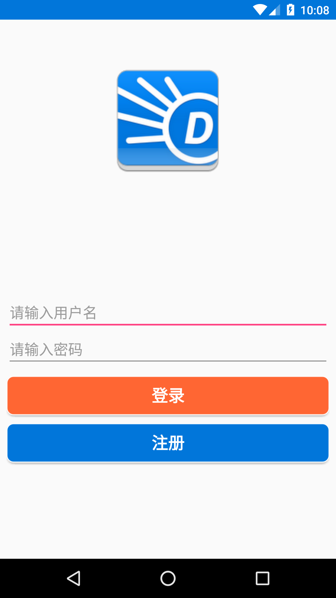

---

### About:

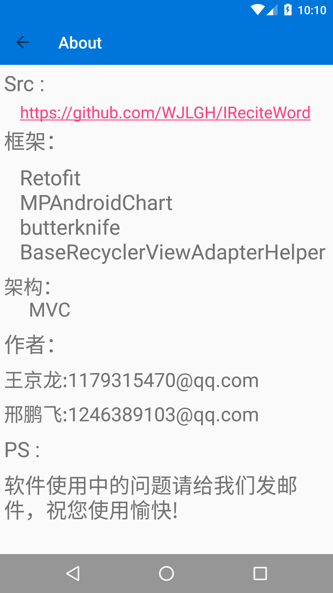

---

---

###  BaseSettings:

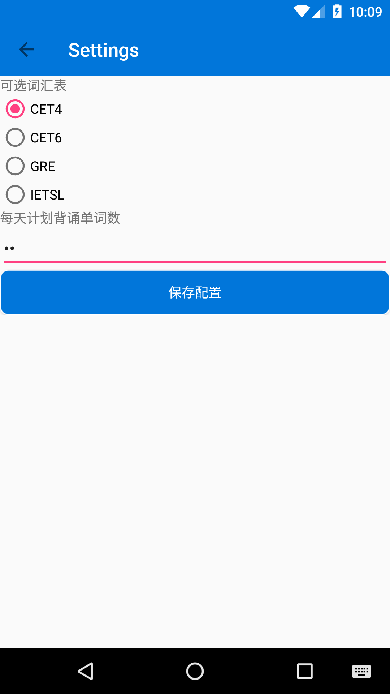

---

---

### ChangePwd:

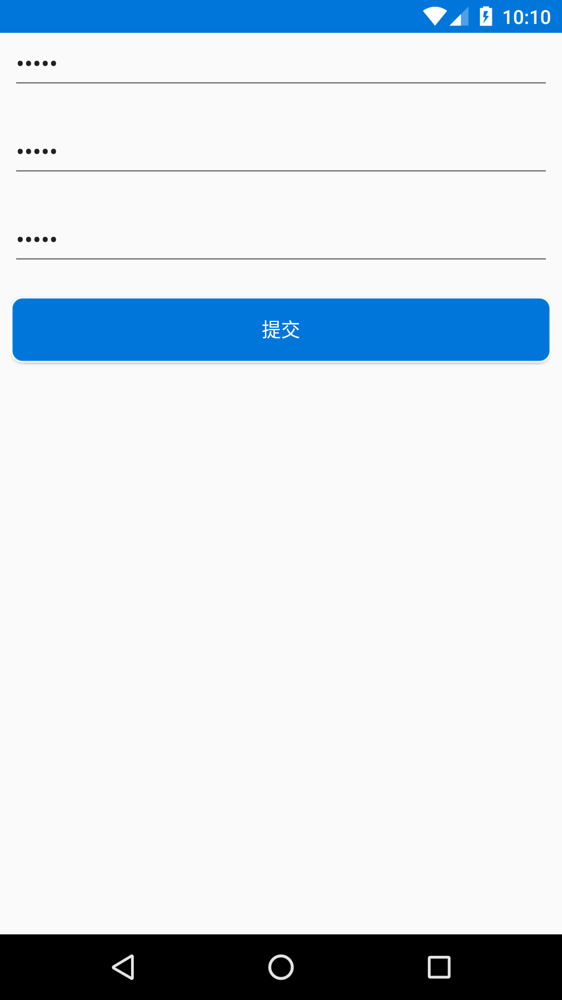

---

---

### detailWord:

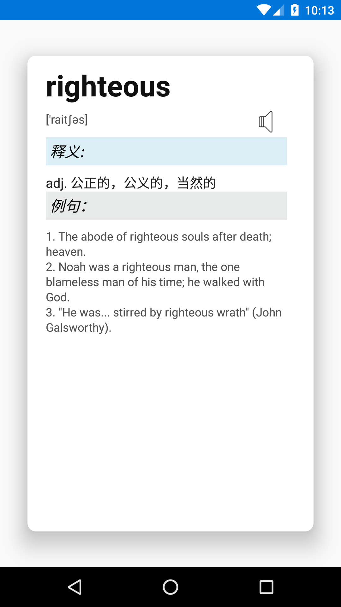

---

---

### LearnWord:

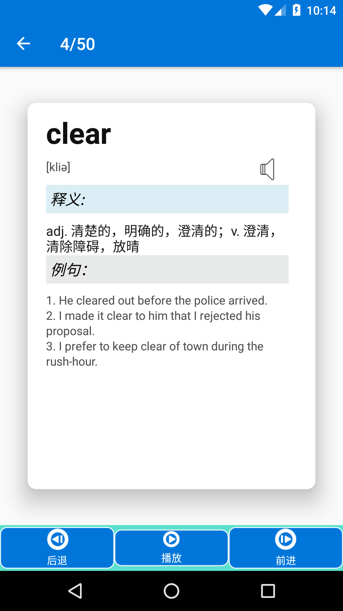

---

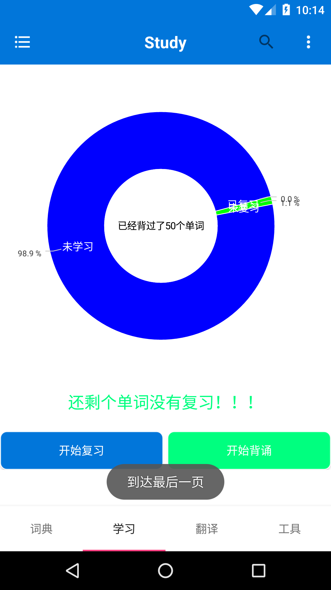

---

### Review:

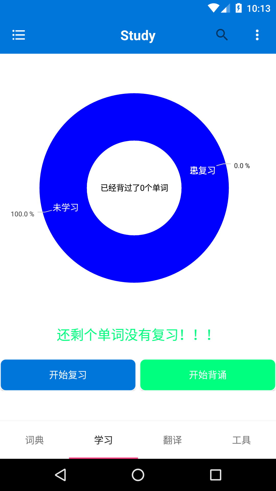

---
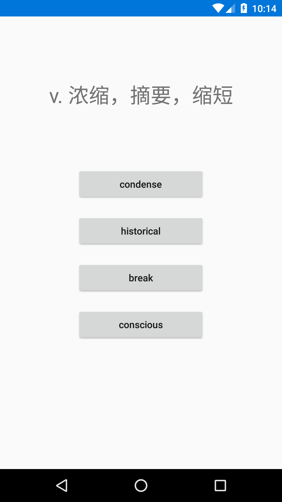

---

### Search:

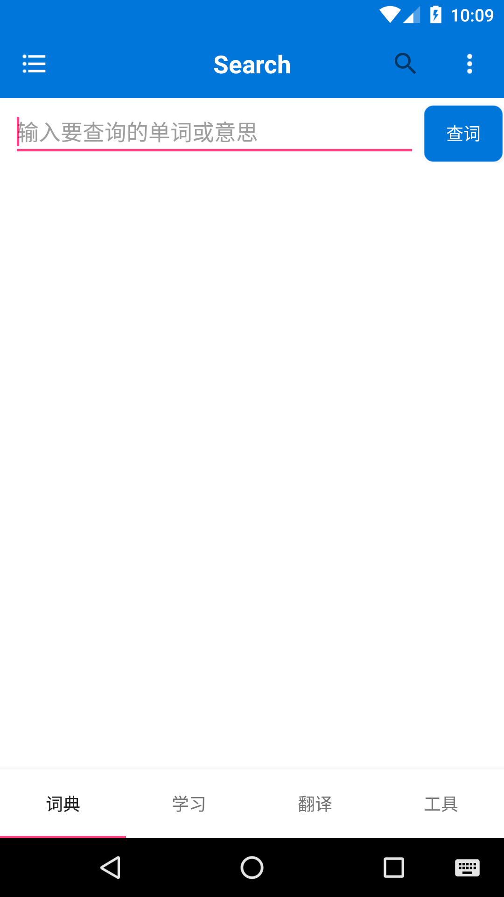

---

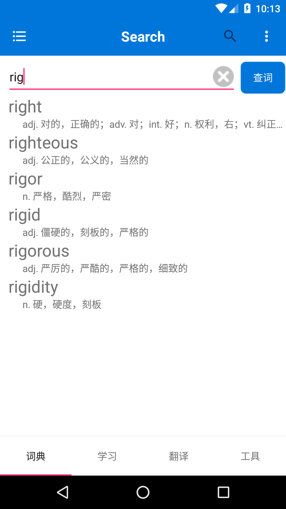

---

### Settings:

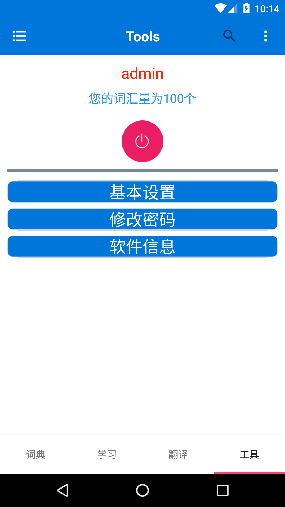

---

---

### Translate:

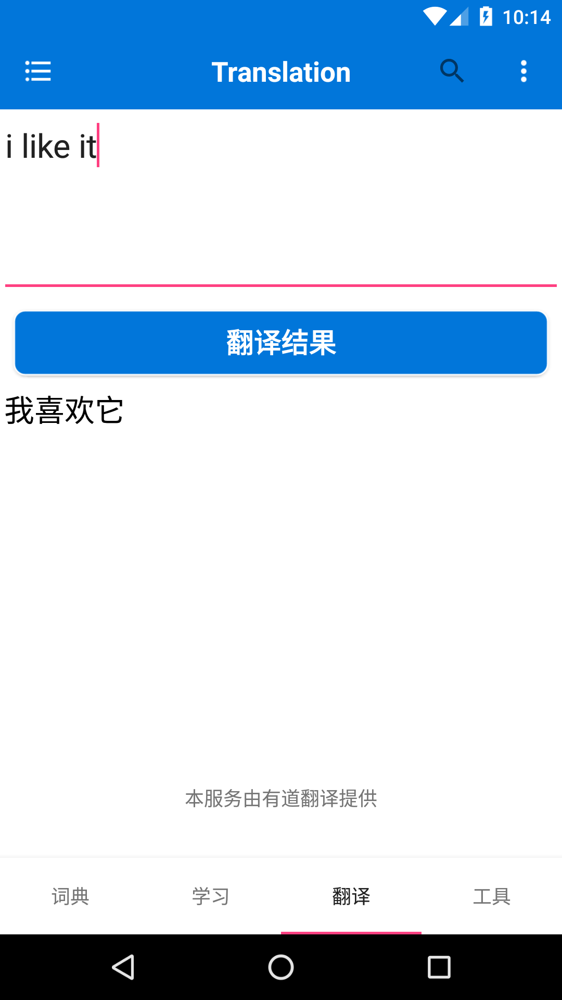

---
